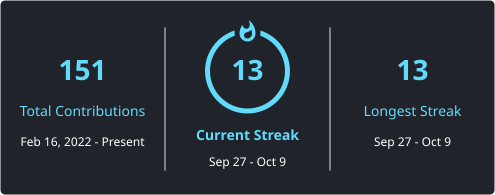

  

## About Me

I'm a **Frontend Developer with 4 years of professional experience** building production-ready web applications.

My core expertise is **React, Next.js, TypeScript, and frontend architecture**, with a focus on reusable component systems, CMS-driven websites, and maintainable monorepos. I'm expanding my backend experience through **Node.js, Express, MongoDB, authentication, and accommodation data modeling**.

- Leading frontend architecture for a real-time visual editing CMS platform
- Building shared UI and CMS-driven page builders across multiple brands
- Working with Sanity, GROQ, visual editing, and Algolia search integrations
- Focused on web performance, accessibility, automated testing, and maintainable frontend architecture
- Building HomiePlace to deepen my experience with TypeScript APIs, JWT authentication, MongoDB data modeling, and media integrations
- Interested in Generative AI, LLM integrations, and AI-powered developer experiences
- Reach me at **[minhnguyenfe892@gmail.com](mailto:minhnguyenfe892@gmail.com)**

---

## Tech Stack

### Frontend

### UI & Component Architecture

### State, Forms & Data

### CMS & Content

### Search & APIs

### Backend & Database

### Backend Integrations

### Development Tooling

### Testing & Quality

---

## Architecture & Engineering

- **Frontend systems:** Shared components, design tokens, and variant-based styling across multiple brands in a pnpm/Turborepo monorepo.
- **CMS integration:** Schema-driven page builders, GROQ projections, Sanity TypeGen, draft previews, and visual editing.
- **Next.js applications:** App Router, Server and Client Components, metadata generation, and content cache revalidation.
- **Search experiences:** Algolia integrations with filtering, pagination, and reusable search components.
- **Backend foundations:** Typed Express handlers, JWT middleware, MongoDB schema validation, and compound indexes.

---
## Featured Project

### [HomiePlace](https://github.com/Kruskal892/HomiePlace)

An **accommodation platform in development**, with a focus on TypeScript backend APIs and MongoDB data modeling.

- **Authentication & profiles:** JWT login, protected profile reads and updates, email verification, and bcrypt password hashing.
- **Password recovery:** Hashed reset tokens with expiry and atomic single-use consumption.
- **Media uploads:** Avatar uploads through Multer and Cloudinary.
- **Accommodation data modeling:** Separate Mongoose schemas for properties, room types, daily inventory, bookings, and inquiries.
- **Data integrity:** Compound indexes, calendar-date and IANA timezone validation, and booking date and price consistency checks.

**Backend:** TypeScript · Node.js · Express · MongoDB · Mongoose · JWT · bcrypt · Multer · Cloudinary · Nodemailer

**Frontend foundation:** React · Vite · Tailwind CSS · React Router

**Current stage:** Backend foundation and accommodation schemas implemented. Frontend integration, booking workflows, and real-time messaging are planned; authentication hardening remains in progress.

[View Repository →](https://github.com/Kruskal892/HomiePlace)

---
## Current Focus

Deepening my full-stack expertise in **backend architecture, database design, authentication and authorization, and system design**.

Learning **DevOps fundamentals**, with a focus on **Docker, Linux, GitHub Actions CI/CD, and application deployment**.

Exploring **Generative AI, LLM integrations, and AI-powered applications**.

---

## GitHub Activity

  
  

---

## Connect

**Frontend Architecture · Full-Stack Development · Developer Experience · AI-Powered Applications**

 

