  

## About Me

I'm a **Frontend Developer with nearly 4 years of professional experience** building production-ready web applications.

My core expertise is **React, Next.js, TypeScript, Headless CMS architecture, and scalable frontend systems**. I'm also expanding deeper into backend development by building full-stack applications with **Node.js, Express, MongoDB, authentication, and real-time communication**.

- Leading frontend architecture for a real-time visual editing CMS platform
- Experienced with scalable monorepos, reusable component systems, and Headless CMS architectures
- Focused on web performance, maintainability, and developer experience
- Building full-stack applications with Node.js, Express, MongoDB, JWT, and Socket.io
- Interested in Generative AI, LLM integrations, and AI-powered developer experiences
- Reach me at **[minhnguyenfe892@gmail.com](mailto:minhnguyenfe892@gmail.com)**

---

## Tech Stack

### Frontend

### UI & Component Architecture

### State, Forms & Data

### Backend & Full Stack

### Architecture, CMS & Tooling

### APIs & Integrations

---

## Selected Work

### [HomiePlace](https://github.com/Kruskal892/HomiePlace)

Full-stack platform for shared housing and roommate collaboration, featuring **room discovery, authentication, media uploads, and real-time messaging**.

**React · TypeScript · Node.js · Express · MongoDB · Socket.io · JWT · Cloudinary**

[View Repository →](https://github.com/Kruskal892/HomiePlace)

---

## Current Focus

Building deeper full-stack expertise in **backend architecture, database design, authentication and authorization, Docker, deployment, system design, and AI integrations**.

---

## GitHub Activity

  
  

---

## Connect

**Frontend Architecture · Full-Stack Development · Developer Experience · AI-Powered Applications**

 

